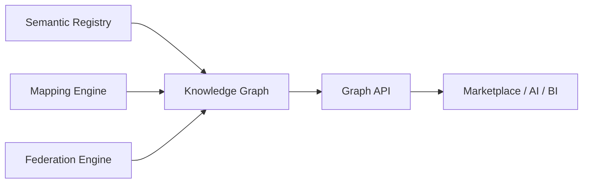

# Knowledge Graph

## Purpose

The **Enterprise Knowledge Graph** is the context layer of the Semantic Control Plane. It connects concepts, business terms, technical assets, data products, KPIs, and policies—without becoming a second SoR for meaning or products.

**Canonical logical model (DA-13):** [Knowledge Graph Logical Model](../01.%20Foundation/18.%20Knowledge%20Graph%20Logical%20Model.md).

## Scope

| In scope | Out of scope (v1) |
| --- | --- |
| Node/edge model, traversal, Graph API | Replacing Registry or Marketplace |
| Impact analysis for semantic change | Full enterprise instance MDM graph |

## Role in architecture



| Owns | Does not own |
| --- | --- |
| Connected context and traversal | Concept prose (Registry) |
| Relationship materialization | Product lifecycle (Marketplace) |

## Example pattern

```text
Customer —owns→ Account —contains→ SIM —belongsTo→ Product
BusinessTerm —mapsTo→ Customer
Table.Column —represents→ Customer
DataProduct —implements→ Customer
natco:Kunde —sameAs→ global:Customer
```

## Persistence

Foundation: Neo4j (graph) + Registry in PostgreSQL; see [Architecture](../01.%20Foundation/05.%20Architecture.md).

## Related

- [Knowledge Graph Logical Model](../01.%20Foundation/18.%20Knowledge%20Graph%20Logical%20Model.md)
- [Nodes](02.%20Nodes.md)
- [Relationships](03.%20Relationships.md)
- [Graph Traversal](04.%20Graph%20Traversal.md)
- [Graph Queries](05.%20Graph%20Queries.md)
- [Semantic Relationships](../04.%20Enterprise%20Semantics/04.%20Semantic%20Relationships.md)
- [APIs](../07.%20Engineering/01.%20APIs.md)
