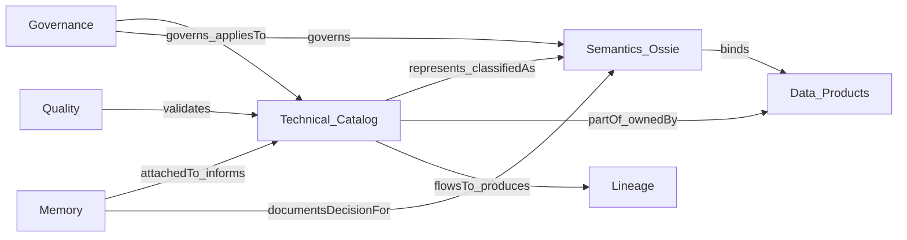

# Context Model

## Purpose

Define the **enterprise metadata context** that humans, AI assistants, and agents need to reason safely over data—inspired by how [OpenMetadata](https://github.com/open-metadata/OpenMetadata) connects technical assets, semantics, governance, lineage, quality, and memory as one graph of typed relationships.

MCP does **not** store every context type only in Section 05. This document defines **what context must exist**, **which capability owns it**, and how the **Semantic Control Plane Knowledge Graph** + mappings connect the graph. Inspiration: [OpenMetadata](https://github.com/open-metadata/OpenMetadata) typed context—not a vendor mandate.

## Inspiration (not a vendor lock)

OpenMetadata positions itself as an open context layer for data and AI: collect and connect the context AI needs to reason safely. We adopt the **same context categories and relationship style**; we implement them across MCP capabilities with **Ossie** as the semantic interchange layer.

## Context types

| Context type | What we capture | Why it matters for AI | MCP home |
| --- | --- | --- | --- |
| **Technical metadata** | Databases, schemas, tables, columns, topics, dashboards, charts, pipelines, APIs, indexes, ML models, storage, types, constraints, descriptions, joins, sample queries, services, owners, teams, usage, domains, data products | Discover what exists and how it is structured | [03. Technical Catalog](../../03.%20Technical%20Catalog/) |
| **Quality and trust** | Test cases, suites, freshness/volume/null/uniqueness/distribution tests, profiling, observability, incidents, alerts, quality history | Avoid treating every dataset as equally trustworthy | Technical Catalog + Governance / Observability |
| **Lineage and impact** | Upstream/downstream, table and column lineage, dashboard/pipeline/metric/ML/API/topic dependencies, OpenLineage events | Explain origin, flow, and blast radius | [08. Lineage](../../08.%20Lineage/) |
| **Semantics** | Glossaries, terms, synonyms, Entropy namespaces (entities, shared properties, metrics, groups), relationships, classifications, tags, domains, data products, policies, Ossie packages | Map technical names to business meaning | **Entropy Semantics** + this section + [04. Business Catalog](../../04.%20Business%20Catalog/) |
| **Governance** | Owners, stewards, teams, policies, roles, classifications, access context, certification, review workflows, lifecycle, data contracts | Act with policy-aware context | [07. Governance](../../07.%20Governance/) + product contracts |
| **Memory and tribal knowledge** | Conversations, AI threads, decisions, assumptions, runbooks, remediation notes, incident learnings, reusable memory attached to assets/users/teams/products/agents | Inherit organizational learning instead of rediscovering every session | Intelligence / Knowledge (later); attach via relationships |
| **Standards and interoperability** | DCAT, DPROD, PROV-O, OpenLineage, ODCS, RDF/OWL, JSON-LD, SHACL, JSON Schema, **Apache Ossie**, APIs, events, metadata schemas | Move context across tools, agents, catalogs, contracts, and graphs | Ontology standards + Integration / API Platform |

## How Section 05 participates

| Section 05 owns | Section 05 links only |
| --- | --- |
| Semantic inventory (entities, concepts, metrics refs, relationship *types*) | Physical table/column inventory |
| Ossie publication of meaning | Lineage edges and OpenLineage ingestion |
| Business / technical / product **semantic** crosswalks | Test case execution results |
| Semantic API for meaning lookup | Full policy engine runtime |

## Entity kinds in the context graph

Minimum entity kinds the relationship catalog must support (aligned with OpenMetadata-style assets):

| Kind | Examples |
| --- | --- |
| **Technical** | Table, Column, Topic, Dashboard, Chart, Pipeline, API, MLModel, SearchIndex, Storage |
| **Semantic** | GlossaryTerm, Metric, KPI, Classification, Tag, Concept, OssieEntity |
| **Product** | DataProduct, DataContract |
| **Governance** | Policy, Team, User, Domain, Persona |
| **Quality** | TestCase, TestSuite, Incident |
| **Lineage** | OpenLineageEvent, LineageEdge |
| **Memory** | AgentConversation, Memory |

## Design rules

1. **Every edge is typed** — no free-text “related to” as the only link; use the [Relationship Catalog](04.%20Semantic%20Relationships.md).
2. **Stable IDs on both ends** — technical asset IDs (Technical Catalog) and semantic IDs (Ossie / concepts).
3. **Semantics are not a second inventory of tables** — Column `represents` Customer Identifier; the column itself lives in Technical Catalog.
4. **AI consumers query the graph**, not a single document — combine context types via relationships.
5. **Depth before breadth** — pilot one domain with the core edges first (`hasColumn`, `represents`, `ownedBy`, `partOf`, `definedBy`, `produces`, `flowsTo`).

## Related

- [Semantic Relationships](04.%20Semantic%20Relationships.md)
- [Architecture](../01.%20Foundation/05.%20Architecture.md)
- [Apache Ossie](../02.%20Ontology/08.%20Apache%20Ossie.md)
- [Technical Mapping](../05.%20Enterprise%20Mapping/02.%20Technical%20Mapping.md)
- [Data Product Mapping](../05.%20Enterprise%20Mapping/03.%20Data%20Product%20Mapping.md)
- Upstream inspiration: [OpenMetadata](https://github.com/open-metadata/OpenMetadata)
