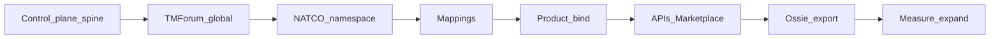

# Roadmap

## Purpose

Sequence delivery of the **Semantic Control Plane**: one-domain MVP first; Marketplace enrichment and OSSIE exchange early; intelligence last.

## MVP goal

Prove in **one domain / one NATCO**:

1. Control plane Registry + Namespace (`global` + one `natco-*`)  
2. Connectors + Mapping Engine (business + technical + product)  
3. Federation Engine edges to global  
4. Semantic API consumed by Marketplace  
5. Ossie export validated  

## Pilot sequence

| Step | Activity | Exit criteria |
| --- | --- | --- |
| 1 | Deploy Registry, Namespace, Governance workflow stubs, Semantic API skeleton | Health + authZ |
| 2 | Import TM Forum SID into `global/`; approve core slice | Core concepts `approved` |
| 3 | Stand up `natco-{code}`; Collibra connector enrichment | Federation edges exist |
| 4 | Map ≥5 technical + business assets | Mapping Engine records active |
| 5 | Bind ≥1 global + ≥1 NATCO product (dual-bind rules) | Marketplace reverse lookup works |
| 6 | Soft gate: warn products without semantics | Marketplace shows warnings |
| 7 | Ossie export `global` + NATCO; expand across NS | Schema-valid packages |
| 8 | Retrospect; next NATCO | Playbook updated |

## Success metrics (pilot)

| Metric | Target |
| --- | --- |
| Approved concepts with URI | 100% of pilot slice |
| Products with binding | 100% of new pilot products |
| Technical maps | ≥5 |
| API | Lookup / expand / validate / resolve |
| Ossie | Validated export for both namespaces |

## Phased backlog

| Phase | Focus |
| --- | --- |
| **0 — Spine** | Architecture, vision, plan, federation (done) |
| **1 — Control plane** | Registry, namespace, ontology, governance, APIs |
| **2 — Mapping** | Business / technical / product engines + soft gate |
| **3 — KG** | Materialize context graph; Graph API |
| **4 — Harden** | Hard product gate; more NATCOs |
| **5 — Discovery** | Search API UX in Marketplace |
| **6 — Intelligence** | MCP agents, recommendations, copilot |

## Explicit deferrals (MVP)

- Full OWL reasoning enterprise-wide  
- Semantic Copilot / recommendation agents as launch  
- Replacing Collibra / Dataplex / Marketplace  
- OSSIE as metadata repository  

## Related

- [Architecture](01.%20Foundation/05.%20Architecture.md)
- [Enterprise Semantics Plan](01.%20Foundation/06.%20Enterprise%20Semantics%20Plan.md)
- [APIs](07.%20Engineering/01.%20APIs.md)
- [Data Product Mapping](05.%20Enterprise%20Mapping/03.%20Data%20Product%20Mapping.md)
