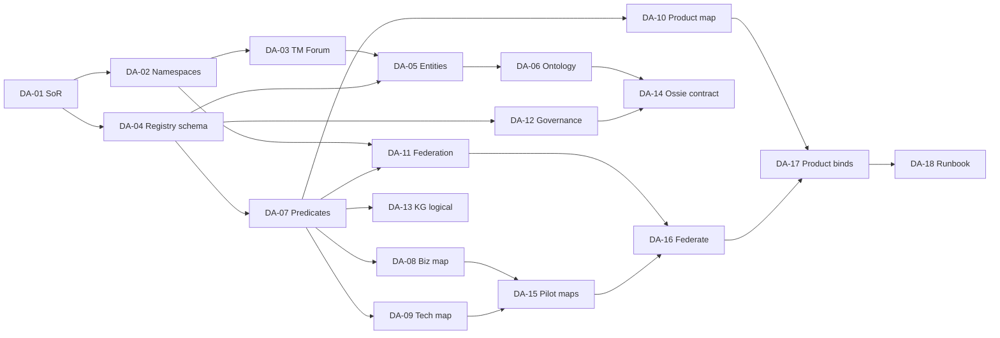

# Roadmap

## Purpose

Sequence delivery of the **Semantic Control Plane**: one-domain MVP first; Marketplace enrichment and OSSIE exchange early; intelligence last.

## MVP goal

Prove in **one domain / one NATCO**:

1. Control plane Registry + Namespace (`global` + one `natco-*`)  
2. Connectors + Mapping Engine (business + technical + product)  
3. Federation Engine edges to global  
4. Semantic API consumed by Marketplace  
5. Ossie export validated  

## Pilot sequence

| Step | Activity | Exit criteria |
| --- | --- | --- |
| 1 | Deploy Registry, Namespace, Governance workflow stubs, Semantic API skeleton | Health + authZ |
| 2 | Import TM Forum SID into `global/`; approve core slice | Core concepts `approved` |
| 3 | Stand up `natco-{code}`; Collibra connector enrichment | Federation edges exist |
| 4 | Map ≥5 technical + business assets | Mapping Engine records active |
| 5 | Bind ≥1 global + ≥1 NATCO product (dual-bind rules) | Marketplace reverse lookup works |
| 6 | Soft gate: warn products without semantics | Marketplace shows warnings |
| 7 | Ossie export `global` + NATCO; expand across NS | Schema-valid packages |
| 8 | Retrospect; next NATCO | Playbook updated |

## Success metrics (pilot)

| Metric | Target |
| --- | --- |
| Approved concepts with URI | 100% of pilot slice |
| Products with binding | 100% of new pilot products |
| Technical maps | ≥5 |
| API | Lookup / expand / validate / resolve |
| Ossie | Validated export for both namespaces |

## Phased backlog

| Phase | Focus |
| --- | --- |
| **0 — Spine** | Architecture, vision, plan, federation (done) |
| **1 — Control plane** | Registry, namespace, ontology, governance, APIs |
| **2 — Mapping** | Business / technical / product engines + soft gate |
| **3 — KG** | Materialize context graph; Graph API |
| **4 — Harden** | Hard product gate; more NATCOs |
| **5 — Discovery** | Search API UX in Marketplace |
| **6 — Intelligence** | MCP agents, recommendations, copilot |

## Explicit deferrals (MVP)

- Full OWL reasoning enterprise-wide  
- Semantic Copilot / recommendation agents as launch  
- Replacing Collibra / Dataplex / Marketplace  
- OSSIE as metadata repository  

## Data Architecture tasks

Work owned by **Data Architecture** only: enterprise meaning model, namespaces, crosswalks, federation rules, and publication contracts. Excludes platform engineering (deploy APIs, connectors runtime, graph DB ops) and Marketplace product build.

| ID | Task | Deliverable | Depends on | Exit criteria |
| --- | --- | --- | --- | --- |
| DA-01 | Freeze control-plane SoR boundaries | [Systems of Record](01.%20Foundation/08.%20Systems%20of%20Record.md) matrix | Architecture spine | **Deliverable ready** — pending Global Council / COE sign-off |
| DA-02 | Define Namespace Registry model | [Namespace Registry](01.%20Foundation/09.%20Namespace%20Registry.md) | DA-01 | **Deliverable ready** — pending COE + pilot NATCO sign-off |
| DA-03 | Select and import TM Forum SID slice | [TM Forum SID Pilot Slice](01.%20Foundation/10.%20TM%20Forum%20SID%20Pilot%20Slice.md) | DA-02 | **Deliverable ready** — pending COE + SID license |
| DA-04 | Design Semantic Registry concept schema | [Semantic Registry Schema](01.%20Foundation/11.%20Semantic%20Registry%20Schema.md) | DA-01 | **Deliverable ready** — pending Platform + Governance alignment |
| DA-05 | Author canonical entity inventory (pilot) | [Canonical Entity Inventory](01.%20Foundation/12.%20Canonical%20Entity%20Inventory.md) | DA-03, DA-04 | **Deliverable ready** — 10 entities + 4 groups as `draft`; pending steward/COE review |
| DA-06 | Define ontology & taxonomy structure | [Ontology and Taxonomy](01.%20Foundation/13.%20Ontology%20and%20Taxonomy.md) | DA-05 | **Deliverable ready** — pending steward facet sign-off |
| DA-07 | Publish relationship / predicate catalog | [Predicate Catalog](01.%20Foundation/14.%20Predicate%20Catalog.md) | DA-04 | **Deliverable ready** — pending COE closed-list acceptance |
| DA-08 | Specify business mapping contract | [Mapping Contracts](01.%20Foundation/15.%20Mapping%20Contracts.md) § DA-08 | DA-04, DA-07 | **Deliverable ready** — pending catalog owner ack |
| DA-09 | Specify technical mapping contract | [Mapping Contracts](01.%20Foundation/15.%20Mapping%20Contracts.md) § DA-09 | DA-04, DA-07 | **Deliverable ready** — pending catalog owner ack |
| DA-10 | Specify product mapping contract | [Mapping Contracts](01.%20Foundation/15.%20Mapping%20Contracts.md) § DA-10 | DA-04, DA-07 | **Deliverable ready** — pending Marketplace ack |
| DA-11 | Define Federation Engine rules | [Federation Engine Rules](01.%20Foundation/16.%20Federation%20Engine%20Rules.md) | DA-02, DA-07 | **Deliverable ready** — pending COE adjudication ack |
| DA-12 | Define Governance Engine states | [Governance Engine](01.%20Foundation/17.%20Governance%20Engine.md) | DA-04 | **Deliverable ready** — pending COE + NATCO RACI sign-off |
| DA-13 | Design KG node/edge logical model | [Knowledge Graph Logical Model](01.%20Foundation/18.%20Knowledge%20Graph%20Logical%20Model.md) | DA-07, DA-08–10 | **Deliverable ready** — pending Platform projection ack |
| DA-14 | Define Ossie package content contract | [Ossie Package Contract](01.%20Foundation/19.%20Ossie%20Package%20Contract.md) | DA-06, DA-12 | **Deliverable ready** — pending COE release-gate ack |
| DA-15 | Pilot content: map ≥5 business + ≥5 technical | [Pilot Content Pack](01.%20Foundation/20.%20Pilot%20Content%20Pack.md) § DA-15 | DA-08, DA-09, connectors available | **Deliverable ready** — 6+6 draft maps; pending steward activate + real IDs |
| DA-16 | Pilot content: federate NATCO→global | [Pilot Content Pack](01.%20Foundation/20.%20Pilot%20Content%20Pack.md) § DA-16 | DA-11, DA-15 | **Deliverable ready** — 5 edges + resolve path; pending approval |
| DA-17 | Pilot content: bind ≥1 global + ≥1 NATCO product | [Pilot Content Pack](01.%20Foundation/20.%20Pilot%20Content%20Pack.md) § DA-17 | DA-10, DA-16 | **Deliverable ready** — dual-bind specs; pending Marketplace ack |
| DA-18 | Publish Data Architecture runbook | [Data Architecture Runbook](01.%20Foundation/21.%20Data%20Architecture%20Runbook.md) | DA-12–17 | **Deliverable ready** — pending stakeholder handoff ack |

### Data Architecture sequence

### Out of Data Architecture scope (hand to other owners)

| Work | Owner |
| --- | --- |
| Deploy Registry / APIs / Kafka / Neo4j | Platform Engineering |
| Build Collibra / Dataplex connectors | Integration / Platform |
| Marketplace UI, soft/hard publish gates | Marketplace / Product |
| MCP Server agent tooling | AI Platform (P3) |
| BI converter implementation | Analytics Engineering |

## Related

- [Architecture](01.%20Foundation/05.%20Architecture.md)
- [Enterprise Semantics Plan](01.%20Foundation/06.%20Enterprise%20Semantics%20Plan.md)
- [Multi-NATCO Federation](01.%20Foundation/07.%20Multi-NATCO%20Federation.md)
- [APIs](07.%20Engineering/01.%20APIs.md)
- [Data Product Mapping](05.%20Enterprise%20Mapping/03.%20Data%20Product%20Mapping.md)
