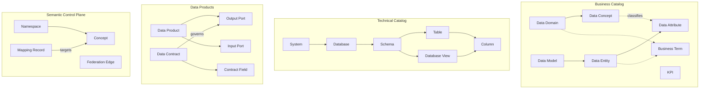
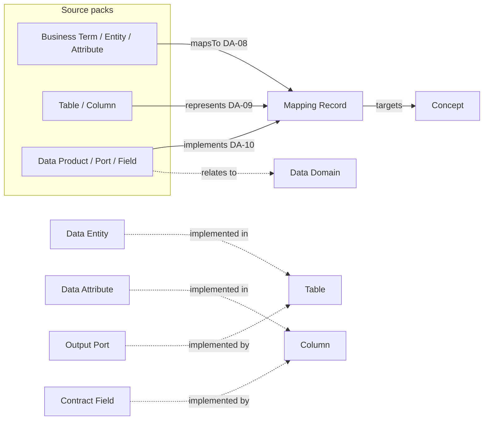
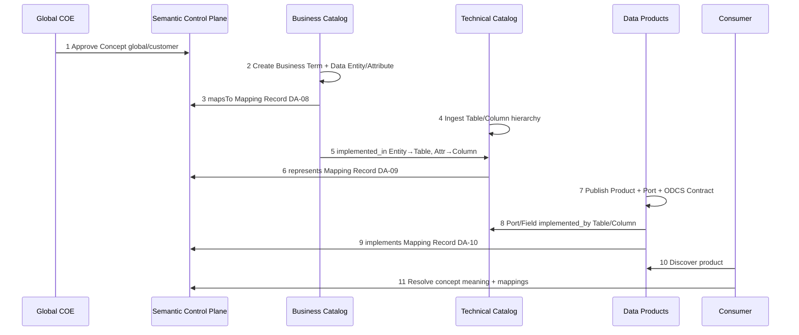
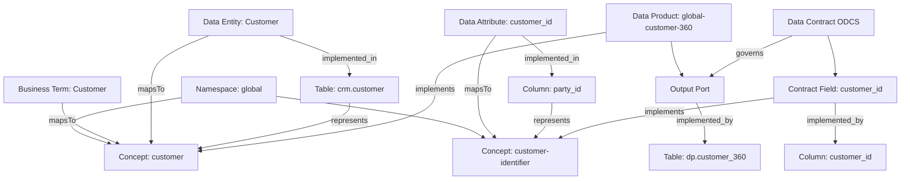

# Cross-Pack Relationships And End-to-End Flow

Complete relationship model across **Business Catalog**, **Technical Catalog**, **Data Products**, and **Semantic Control Plane**.

Machine inventory: [`cross-pack.relations.json`](cross-pack.relations.json)  
Worked example: [`examples/end-to-end-customer-flow.json`](examples/end-to-end-customer-flow.json)

---

## 1. Pack roles (SoR)

| Pack | Owns (SoR) | Does not own |
| --- | --- | --- |
| [Business Catalog](Business%20Catalog/) | Glossary prose, conceptual & Collibra logical models | Canonical concept definitions |
| [Technical Catalog](Technical%20Catalog/) | Physical / file asset inventory | Business meaning |
| [Data Products](Data%20Products/) | Product identity, ports, ODCS contracts (Marketplace) | Concept prose |
| [Semantic Control Plane](Semantic%20Control%20Plane/) | Namespaces, concepts, mappings, federation | Catalog inventory / product lifecycle |

---

## 2. Complete relationship map

### 2.1 Within each pack (containment)



### 2.2 Cross-pack bridges (normative)



### 2.3 Relation catalog (all cross-pack edges)

| ID | From (pack · type) | Predicate | To (pack · type) | Owner / SoR | DA |
| --- | --- | --- | --- | --- | --- |
| X1 | Business · Business Term | `mapsTo` | SCP · Concept | Mapping Engine | DA-08 |
| X2 | Business · KPI | `mapsTo` | SCP · Concept (`metric`) | Mapping Engine | DA-08 |
| X3 | Business · Data Entity | `mapsTo` | SCP · Concept (`entity`) | Mapping Engine | DA-08 |
| X4 | Business · Data Attribute | `mapsTo` | SCP · Concept (`shared_property`) | Mapping Engine | DA-08 |
| X5 | Business · Data Concept | `mapsTo` | SCP · Concept | Mapping Engine | DA-08 |
| X6 | Business · Data Domain | `mapsTo` | SCP · Concept (`group`) | Mapping Engine | DA-08 |
| X7 | Technical · Table | `represents` | SCP · Concept (`entity`) | Mapping Engine | DA-09 |
| X8 | Technical · Column | `represents` | SCP · Concept (`shared_property`) | Mapping Engine | DA-09 |
| X9 | Technical · Database View | `represents` | SCP · Concept (`entity`) | Mapping Engine | DA-09 |
| X10 | Technical · Field | `represents` | SCP · Concept | Mapping Engine | DA-09 |
| X11 | Data Products · Data Product | `implements` | SCP · Concept | Mapping Engine | DA-10 |
| X12 | Data Products · Output Port | `exposes` / `implements` | SCP · Concept | Mapping Engine | DA-10 |
| X13 | Data Products · Contract Field | `implements` | SCP · Concept | Mapping Engine | DA-10 |
| X14 | Business · Data Entity | `implemented_in` | Technical · Table | Catalog (Collibra) | — |
| X15 | Business · Data Attribute | `implemented_in` | Technical · Column | Catalog (Collibra) | — |
| X16 | Data Products · Port | `implemented_by` | Technical · Table | Marketplace / Collibra | — |
| X17 | Data Products · Contract Field | `implemented_by` | Technical · Column | Marketplace / Collibra | — |
| X18 | Data Products · Data Product | `relates_to` | Business · Data Domain | Catalog / Marketplace | — |
| X19 | SCP · Concept (natco) | `federates` | SCP · Concept (global) | Federation Engine | DA-11 |

**Legend:** X1–X13 = meaning crosswalks · X14–X18 = structural bridges · X19 = federation

---

## 3. Complete end-to-end flow (Customer 360)

### 3.1 Narrative steps

| Step | Actor / system | Action | Result |
| --- | --- | --- | --- |
| 1 | Global COE | Approve SID-seeded Concept `global/customer` in Namespace `global` | Canonical meaning exists |
| 2 | NATCO steward | Publish Business Term “Customer” / “Kunde” in Collibra | Glossary prose (Business Catalog) |
| 3 | Mapping Engine | Create Mapping Record Term → `mapsTo` → `global/customer` | DA-08 active |
| 4 | Stewardship | Create Data Model → Data Entity `Customer` → Data Attribute `customer_id` | Collibra semantic layer |
| 5 | Mapping Engine | Entity/Attribute `mapsTo` → `global/customer` / `global/customer-identifier` | Logical model aligned |
| 6 | Scanner | Ingest Database → Schema → Table `crm.customer` → Column `party_id` | Technical Catalog |
| 7 | Catalog | Link Data Entity `implemented_in` Table; Attribute `implemented_in` Column | Structural bridge |
| 8 | Mapping Engine | Table/Column `represents` → same Concept URIs | DA-09 active |
| 9 | Product owner | Publish Data Product `global-customer-360` + Output Port + ODCS Data Contract + fields | Data Products |
| 10 | Marketplace / Mapping | Port `implemented_by` curated Table; Field → Column; Product/Field `implements` Concepts | DA-10 + ODCS semantics |
| 11 | Consumer | Discovers product; resolves meaning via Control Plane APIs | One shared “Customer” |

### 3.2 Flow diagram



### 3.3 Object graph (same example)



JSON walkthrough of these ids: [`examples/end-to-end-customer-flow.json`](examples/end-to-end-customer-flow.json)

---

## 4. Convergence rule (one meaning)

For any business object (e.g. Customer):

| Layer | Object | Must agree on |
| --- | --- | --- |
| Control Plane | Concept URI | `…/ns/global/customer` |
| Business | Term + Entity `mapsTo` | Same URI |
| Technical | Table `represents` | Same URI |
| Product | Product/Field `implements` | Same URI |

If URIs diverge → Mapping Engine / Federation conflict → Global COE.

---

## 5. NATCO variant

```text
natco-de Business Term "Kunde"
    mapsTo → Concept natco-de/kunde
                 │
                 Federation Edge sameAs
                 ▼
            Concept global/customer  ◀── Technical Table represents
                                     ◀── Product implements (prefer global)
```

Rule: cross-NATCO products and reporting bind to **`global`** (or require approved federation).

---

## 6. Quick navigation

| Need | Go to |
| --- | --- |
| Physical hierarchy | [Technical Catalog](Technical%20Catalog/01.%20Hierarchy%20And%20Relations.md) |
| Glossary + logical model | [Business Catalog](Business%20Catalog/01.%20Hierarchy%20And%20Relations.md) |
| Product / ODCS | [Data Products](Data%20Products/01.%20Hierarchy%20And%20Relations.md) |
| Concepts / mappings | [Semantic Control Plane](Semantic%20Control%20Plane/01.%20Hierarchy%20And%20Relations.md) |
| Machine cross-pack edges | [`cross-pack.relations.json`](cross-pack.relations.json) |
