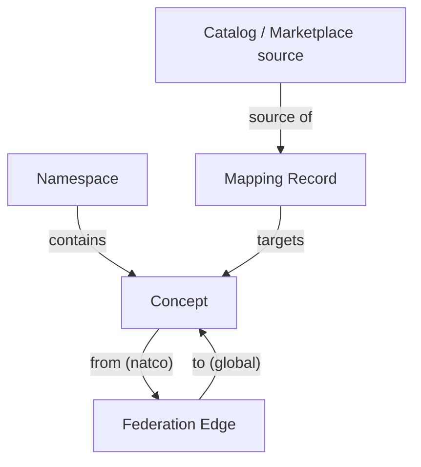

# Hierarchy And Relations — Semantic Control Plane

## Object model

## Chains

| Chain | Path |
| --- | --- |
| Registry | Namespace → Concept |
| Mapping | External asset → Mapping Record → Concept |
| Federation | Concept (`natco-*` / `import-*`) → Federation Edge → Concept (`global`) |

## Normative relations

| From | Predicate | To | Notes |
| --- | --- | --- | --- |
| Namespace | contains | Concept | Every concept in exactly one namespace |
| Mapping Record | targets | Concept | Active mappings require `status=approved` on target |
| Concept | federates via Edge | Concept | Directed NATCO/import → global |

## Rules

1. Control Plane is the **only** SoR for enterprise meaning.  
2. Business Catalog Collibra semantic layer ≠ this pack.  
3. Prefer `global/*` mapping targets when meaning is shared.  
4. Cross-NATCO use of a NATCO concept requires an approved Federation Edge.  

JSON: [`hierarchy.relations.json`](hierarchy.relations.json)
