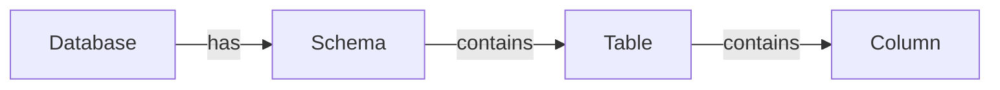

# Hierarchy And Relations

## Purpose

Freeze the **enterprise-standard containment hierarchy** for technical catalog assets. NATCO Collibra assignments (e.g. Hungary) must implement this chain; legacy shortcuts are non-normative.

## Canonical chain

| # | Source type | Predicate (display) | Target type | Cardinality (source → target) | Public ID (recommended) |
| --- | --- | --- | --- | --- | --- |
| 1 | Database | has Schema | Schema | `0..*` | `TechnologyAssetHasSchema` |
| 2 | Schema | contains Table | Table | `0..*` | `SchemaContainsTable` |
| 3 | Table | contains Column | Column | `1..*` | `TableContainsColumn` |

## Inverse sides (required for navigation)

Collibra models relations as bidirectional roles. Templates include the inverse side so asset pages can traverse both directions.

| # | Source type | Predicate (display) | Target type | Cardinality | Public ID (recommended) |
| --- | --- | --- | --- | --- | --- |
| 1′ | Schema | belongs to Database | Database | `1..1` | `TechnologyAssetHasSchema` (role: belongs to) |
| 2′ | Table | is part of Schema | Schema | `1..1` | `SchemaContainsTable` (role: is part of) |
| 3′ | Column | is part of Table | Table | `1..1` | `ColumnIsPartOfTable` |

## Rules

| # | Rule |
| --- | --- |
| 1 | Every **Schema** must belong to exactly one **Database**. |
| 2 | Every **Table** must belong to exactly one **Schema**. |
| 3 | Every **Column** must belong to exactly one **Table**. |
| 4 | Do **not** use Database → contains → Table as the primary path. Prefer Database → Schema → Table. |
| 5 | Qualified names should reflect the chain: `{database}.{schema}.{table}.{column}` (platform syntax may vary). |
| 6 | Control Plane `represents` mappings typically target **Table** (entity) and **Column** (property); Database/Schema are structural context. |

## Non-normative / legacy

Some NATCO assignments also expose **Database → contains → Table** (`TableIsPartOfDatabase`). Treat as a **legacy convenience link** only:

- Do not rely on it for ingestion or mapping identity.
- Prefer resolving Table via Schema when both exist.
- New assignments must not require it.

## Shared characteristics (all four types)

| Name | Public ID | Kind | Min | Notes |
| --- | --- | --- | --- | --- |
| Description | `Description` | Text | 1 | Verbose asset description |
| Last Sync Date | `LastSyncDate` | Date | 0 | Last sync from external system / scanner |
| Note | `Note` | Text | 0 | Free-form steward note |
| impacted by Issue | `IssueImpactsAsset` | Explicit Relation → Issue | 0 | Optional governance link |

## Mapping Engine usage

| Catalog asset | Typical `source_type` | Typical `represents` target |
| --- | --- | --- |
| Database | `other` / structural | Rarely mapped |
| Schema | `dataset` / structural | Rarely mapped |
| Table | `table` | Entity concept IRI |
| Column | `column` | Property / identifier concept IRI |

Contract: [Mapping Contracts — DA-09](../01.%20Foundation/15.%20Mapping%20Contracts.md) · [Technical Mapping](../05.%20Enterprise%20Mapping/02.%20Technical%20Mapping.md)

## Assets

| Asset | Asset type page | Characteristics | Contract |
| --- | --- | --- | --- |
| [Database](Database/) | [00. README](Database/00.%20README.md) | [01. Characteristics](Database/01.%20Characteristics.md) | [`contract.json`](Database/contract.json) |
| [Schema](Schema/) | [00. README](Schema/00.%20README.md) | [01. Characteristics](Schema/01.%20Characteristics.md) | [`contract.json`](Schema/contract.json) |
| [Table](Table/) | [00. README](Table/00.%20README.md) | [01. Characteristics](Table/01.%20Characteristics.md) | [`contract.json`](Table/contract.json) |
| [Column](Column/) | [00. README](Column/00.%20README.md) | [01. Characteristics](Column/01.%20Characteristics.md) | [`contract.json`](Column/contract.json) |

Documentation pattern: [02. Collibra Documentation Standard](02.%20Collibra%20Documentation%20Standard.md)

## Shared contracts

- [Hierarchy contract](hierarchy.relations.json) — `ctr-tech-hierarchy-v1`
- [Contracts index](index.json)
- [Sample assets](examples/sample-assets.json)
