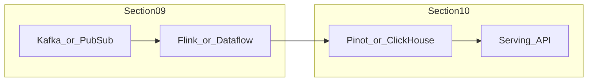

# Real-Time Analytics Architecture

## Definition

Real-time analytics architecture delivers sub-second query and dashboard results on continuously arriving data. It sits **downstream** of stream processing (section 09) and focuses on **serving engines** — not event transport or transformation.

## Boundary with section 09

| Layer | Section | Responsibility |
| --- | --- | --- |
| Ingest & process | 09 | Events, CDC, stream processors, watermarks |
| Serve & query | 10 | OLAP stores, materialized views, low-latency APIs |

## Reference stack

## Related

- [Section 10 README](../../README.md)
- [Streaming to Lakehouse](../../09_Event_And_Streaming_Architecture/09.04_Architecture_Patterns/09.04.05_Reference_Architectures/09.04.05.03_Streaming_To_Lakehouse.md)
- [ClickHouse](../10.01_ClickHouse/README.md)
