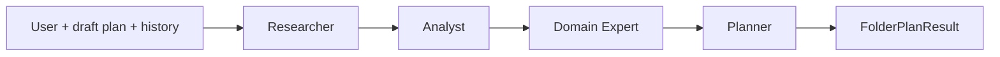

# KEW Chat Agent Flow

End-to-end reference for the KEW workbench assistant: **Plan mode**, **Agent mode**, multi-agent folder planning, context sharing, and persistence.

## Overview

The assistant operates on the **active workbench tab** (file or folder). Two modes share **section context** but keep **separate chat threads**:

| Mode | Purpose | Typical workflow |
|------|---------|------------------|
| **Plan** | Design structure, advise, plan folders | Folder tab → 4-agent pipeline |
| **Agent** | Implement plans, edit documents | File tab → editor; folder tab → advise + open-file edits |

```
┌─────────────────────────────────────────────────────────────────┐
│  Workbench tab (file:path or folder:path)                       │
│  Chat mode: plan | agent                                        │
└────────────────────────────┬────────────────────────────────────┘
                             │
         ┌───────────────────┴───────────────────┐
         ▼                                       ▼
  POST /chat/conversations/resolve          folderPlanStore (browser)
  → scoped JSON thread per tab+mode         → draft structure (shared)
         │
         ▼
  POST /messages/stream
         │
         ▼
  ChatService.iter_message_events
```

## Persistence layers

| Layer | Location | Scoped by |
|-------|----------|-----------|
| Chat messages | `.data/conversations/{uuid}.json` | `scope_kind` + `scope_path` + `chat_mode` |
| Section lineage | `.data/section_context/{kind}:{path}.json` | File/folder path (**shared** across modes) |
| Folder draft plan | Browser `localStorage` | Folder path |
| Change plans | `.data/edits/{edit_id}.json` | Document path |

### Conversation resolve

`POST /chat/conversations/resolve` returns an existing thread or creates one:

```json
{
  "scope_kind": "folder",
  "scope_path": "04_Data_Modeling_Architecture/03_Modern/02_Semantic_Modeling",
  "chat_mode": "plan"
}
```

Index key: `folder:04_Data_Modeling_Architecture/...:plan`

Switching tabs or modes loads the correct history. Page refresh resumes via resolve.

## Plan ↔ Agent context sharing

Plan and Agent modes have **separate message histories** but share:

1. **Section lineage** (`.data/section_context/`) — last folder plan summary, target tree, event log
2. **Other mode's conversation** — injected into prompts as continuity block
3. **Folder draft plan** (`folderPlanStore`) — sent on every message as `folder_plan`
4. **On-disk tree + file samples** — loaded for folder scope

When Agent mode runs, the prompt includes:

```
## Shared section context (Plan ↔ Agent lineage)
### Last folder plan (from Plan mode)
...
### Target structure
...
### Plan mode thread (for continuity)
...
### Agent mode directive
Implement recommendations from Plan mode...
```

## Orchestrator workflow (every message)

All messages pass through three orchestrator steps (stable trail IDs):

```
1. read_context     → Load tabs, folder plan, disk tree, cross-mode lineage
2. classify_intent  → Route (skipped for folder+plan)
3. respond          → Branch to folder pipeline | editor | advisor
```

SSE events: `execution_plan` → `trail_step` → `agent_thought` → `assistant_delta` → `done`

## Workflow A: Plan mode on folder tab

**Trigger:** `folder_path` set + `chat_mode: plan`

**Intent:** Forced advisory (no document edits in this branch)

**Pipeline:** `run_folder_plan_pipeline` — four agents in sequence:



### Agent responsibilities

| Agent | Input | Output | Thought process (streamed) |
|-------|-------|--------|---------------------------|
| **Researcher** | User directives, disk tree, workspace | `TopicResearchOutput` | Topic summary, key concepts, standards, depth |
| **Analyst** | Research + on-disk tree | `FolderAnalysisOutput` | Strengths, gaps, redundancies, naming issues |
| **Domain Expert** | Research + analysis | `FolderExpertOutput` | Pillars, critical topics, anti-patterns |
| **Planner** | All prior stages + user directives | `FolderPlanResult` | Target ASCII tree + reorganization actions |

Each stage:

1. Creates one trail step (`RUNNING`)
2. Runs structured LLM call
3. Emits `agent_thought` with stage reasoning
4. Completes the **same** trail step (`COMPLETED`) — no duplicate rows

**Output:** `folder_plan_result` in response; UI merges into planning textarea; lineage saved to section context.

## Workflow B: Agent mode on file tab

**Trigger:** `document_path` set + `chat_mode: agent`

**Intent:** Orchestrator classifies → `requires_change_plan` true/false

| Intent result | Path |
|---------------|------|
| `requires_change_plan: true` | Planner → Editor → diff hunks → approval card |
| `requires_change_plan: false` | Advisor (Q&A) |

**Editor sub-trail:** load document → planner proposes body → build hunks → ready for review

**Context includes:** document body, outline, active section, open tabs, conversation history, cross-mode lineage.

## Workflow C: Agent mode on folder tab

**Trigger:** `folder_path` set + `chat_mode: agent`

**Default:** Advisory (orchestrator intent, edits blocked unless open `.md` tab)

If user has a **markdown file open** in editor tabs, `doc_path` is inferred from `open_paths` so Agent mode can propose **document change plans** for that file while scoped to the folder.

**Context includes:** full Plan mode lineage + last target structure + plan thread.

## Workflow D: Plan mode on file tab

**Trigger:** `document_path` + `chat_mode: plan`

**Behavior:** Advisory only (`requires_change_plan` forced false). Use for outlining and strategy; switch to Agent mode to apply edits.

## Chat history operations

| Action | API | Effect |
|--------|-----|--------|
| Edit message | `PATCH .../messages/{id}` | Updates user message; **truncates** all messages after |
| Regenerate | `POST .../messages/{id}/regenerate/stream` | New assistant reply from edited branch |
| Delete message | `DELETE .../messages/{id}` | Removes message and everything after |
| Clear chat | `POST .../clear` | Empties messages; keeps conversation ID |
| Clear scope | `DELETE .../conversations/{id}` | Deletes thread |

## Frontend components

| Component | Role |
|-----------|------|
| `useChat` | Resolve conversation, stream events, cross-mode context via API |
| `ChatMessageList` | History + live trail |
| `ExecutionTrailPanel` | Agent workflow steps + live thoughts |
| `UserMessageBubble` | Edit / delete with branch reset |
| `folderPlanStore` | Shared draft structure |
| `SectionLineageBanner` | Shows last plan summary + recent lineage |

## API reference (chat)

| Method | Path |
|--------|------|
| POST | `/chat/conversations/resolve` |
| GET | `/chat/conversations/{id}` |
| POST | `/chat/conversations/{id}/messages/stream` |
| POST | `/chat/conversations/{id}/messages/{id}/regenerate/stream` |
| PATCH | `/chat/conversations/{id}/messages/{id}` |
| DELETE | `/chat/conversations/{id}/messages/{id}` |
| POST | `/chat/conversations/{id}/clear` |
| GET | `/chat/section-context?scope_kind=&scope_path=` |

## Debugging checklist

1. **Trail shows duplicate steps** — ensure folder pipeline uses `trail.complete(step.id)` not second `trail.add()`
2. **Plan suggestions lost in Agent** — check `.data/section_context/` and cross-mode block in context
3. **History not resuming** — verify resolve returns same `id`; check `_scope_index.json`
4. **Edits blocked on folder** — open target `.md` in a tab; use Agent mode
5. **Mock mode** — set `KEW_API_AI_MOCK_MODE=true` for offline pipeline smoke tests

## Key source files

```
services/api/src/kew_api/
  services/chat_service.py          # Main orchestrator
  ai/folder_plan_runner.py          # 4-agent folder pipeline
  services/execution_trail.py       # Trail builder
  services/chat_repository.py       # Conversation + scope index
  services/section_context_repository.py  # Plan↔Agent lineage
  api/v1/chat.py                    # HTTP/SSE endpoints

apps/workbench/src/features/ai/
  hooks/useChat.ts
  components/ExecutionTrailPanel.tsx
  components/ChatMessageList.tsx
```
