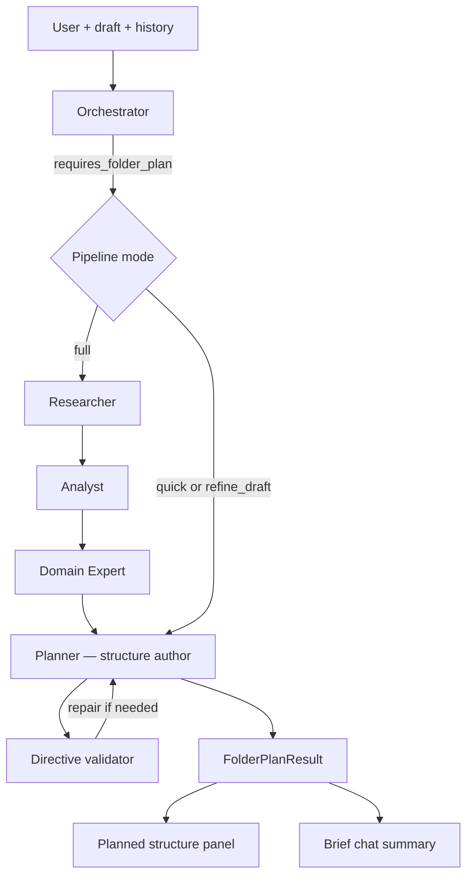

# KEW Chat Agent Flow

End-to-end reference for the KEW workbench assistant: **Plan mode**, **Agent mode**, multi-agent folder planning, context sharing, and persistence.

## Overview

The assistant operates on the **active workbench tab** (file or folder). **Plan** and **Agent** modes share **one chat thread** per section and **section context** (lineage, last plan).

| Mode | Purpose | Typical workflow |
|------|---------|------------------|
| **Plan** | Design structure, advise, plan folders | Folder tab → coordinator → folder pipeline or advisor |
| **Agent** | Implement plans, edit documents | File tab → editor; folder tab → advise + open-file edits |

```
┌─────────────────────────────────────────────────────────────────┐
│  Workbench tab (file:path or folder:path)                       │
│  Chat mode: plan | agent  (shared conversation per section)   │
└────────────────────────────┬────────────────────────────────────┘
                             │
         ┌───────────────────┴───────────────────┐
         ▼                                       ▼
  POST /chat/conversations/resolve          folderPlanStore (browser)
  → scoped JSON thread per tab              → draft structure (shared)
         │
         ▼
  POST /messages/stream
         │
         ▼
  ChatService.iter_message_events
```

## Persistence layers

| Layer | Location | Scoped by |
|-------|----------|-----------|
| Chat messages | `.data/conversations/{uuid}.json` | `scope_kind` + `scope_path` (unified) |
| Section lineage | `.data/section_context/{kind}__{path}.json` | File/folder path (shared across modes) |
| Folder draft plan | Browser `localStorage` | Folder path |
| Change plans | `.data/edits/{edit_id}.json` | Document path |

### Conversation resolve

`POST /chat/conversations/resolve` returns an existing thread or creates one:

```json
{
  "scope_kind": "folder",
  "scope_path": "04_Data_Modeling_Architecture/03_Modern/02_Semantic_Modeling",
  "chat_mode": "plan"
}
```

Index key: `folder:04_Data_Modeling_Architecture/03_Modern/02_Semantic_Modeling`

Plan and Agent modes resolve to the **same** conversation ID for a section. Messages are tagged with `chat_mode` per turn.

## Orchestrator workflow (every message)

```
1. read_context     → Load tabs, folder plan, disk tree, siblings, section lineage
2. classify_intent  → Coordinator sets requires_folder_plan / requires_change_plan
3. respond          → Folder pipeline | editor | advisor
```

SSE events: `execution_plan` → `trail_step` → `agent_thought` → `assistant_delta` → `done`

## Workflow A: Plan mode on folder tab

**Trigger:** `folder_path` + `chat_mode: plan` + `requires_folder_plan: true`

Refinement phrases (*use my structure*, *try again*, *instead*, *update the plan*) also trigger the pipeline.

**Greetings and general questions** route to the Advisor (no structure planning).

### Folder planning pipeline



### Agent responsibilities

| Step | Agent | Output | Produces folder tree? |
|------|-------|--------|----------------------|
| 0 | **Orchestrator** | `requires_folder_plan` routing | No |
| 1 | **Researcher** | `TopicResearchOutput` | No |
| 2 | **Analyst** | `FolderAnalysisOutput` | No |
| 3 | **Domain Expert** | `FolderExpertOutput` | No |
| 4 | **Planner** | `FolderPlanResult` | **Yes — only this agent** |

### Pipeline modes

| Mode | When | Stages run |
|------|------|------------|
| `full` | Greenfield / deep research requests | Researcher → Analyst → Expert → Planner |
| `quick` | Simple design requests, no draft | Planner only (ChatGPT-style single pass) |
| `refine_draft` | Planned structure textarea has content | Planner only (honors user draft) |

After Planner returns, a **directive validator** checks user-named paths/topics appear in the output; one repair pass runs if items are missing.

**Output:** `folder_plan_result` merges into Planned structure panel; agent inputs stored in section context; brief summary in chat.

## Workflow B–D

(Unchanged: Agent mode on file/folder, Plan mode on file tab — see prior sections in API README.)

## Frontend components

| Component | Role |
|-----------|------|
| `useChat` | Resolve conversation, stream events, apply folder plans |
| `FolderPlanningPanel` | Draft structure + agent inputs from last run |
| `ExecutionTrailPanel` | Agent workflow steps + live thoughts |
| `folderPlanStore` | Shared draft structure (localStorage) |

## Key source files

```
backend/api/src/kew_api/
  services/chat_service.py
  ai/folder_plan_runner.py
  ai/folder_plan_validator.py
  services/section_context_repository.py

frontend/src/features/
  ai/hooks/useChat.ts
  workspace/components/FolderPlanningPanel.tsx
```
